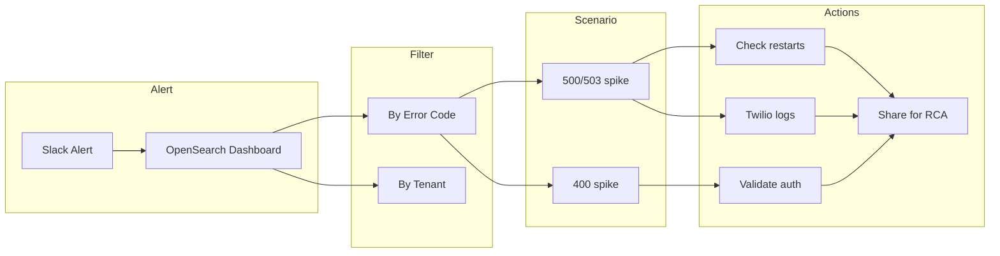

# Stream Server Alerts – Triage and Debug

## When to Use

Apply this skill when the user is responding to an alert from **#stream-prod-alerts** or asking how to debug Stream Server / Bot Engine errors.

## What This Alert Is

- **Summary:** Significant increase in errors in Bot Engine logs for the Stream Server.
- **Common error codes:** 400 (Bad Request / Invalid input), 500 (Internal Server Error), 503 (Service Unavailable).
- **Typical causes:** Timeout exceeded, execution failure, authentication issues, external service failure (e.g. Speechmatics).

## Key Links

| Resource | Link / Path |
|----------|-------------|
| OpenSearch Dashboards – Prod | https://app-opensearch-prod.interface.ai/_dashboards/app/home#/ |
| Slack | #stream-prod-alerts (use "View Dashboard" in the alert) |
| AWS | AWS Start (access portal) → Applications → Interface OpenSearch App Prod |
| Twilio Console | For call logs and Call SID |
| Lens | Production cluster → Workloads → Pods (filter by CU / engine) |
| Production Test Account | Production Test Account Sheet (Dialpad test details) |

## High-Level Workflow

## Step-by-Step

### Step 1 – Access OpenSearch

- From **#stream-prod-alerts**, click **View Dashboard** in the alert.
- If access fails: log in to **AWS Start** → **Applications** → **Interface OpenSearch App Prod**, then retry the View Dashboard link from Slack.

### Step 2 – Get Error Count and Impacted CU

In OpenSearch:

- **By error code:** Expand an error entry → in table view select **error_code** → add as filter (e.g. `error_code = 503`). Repeat for other codes as needed.
- **By tenant:** Expand an entry → locate **tenant_name** → add **tenant_name** as filter to see error count for that CU.

### Step 3 – Choose Scenario

#### Scenario 1 – High 500 / 503

1. **Identify:** Use OpenSearch filters to get total error count and the CU with the highest errors (see Step 2).
2. **Validate production:** Make test calls to the production number using Dialpad. Note: calls connect every time **vs** fail intermittently or consistently.
3. **Branch:**
   - **Case A – Calls connect successfully:**
     - Check for Bot Engine restarts: open **Lens** → Production cluster → **Workloads → Pods** → filter by CU name and engine type → check **Age** column for restart time.
     - If restart detected: follow "Identifying Restart Cause and CPU Spike in Bot engine" runbook.
     - If no restart: follow **3.3.1** (Twilio call logs below).
   - **Case B – Calls fail intermittently or consistently:**
     - Follow **3.3.1** (Twilio). Open a bridge and drive to resolution.
4. **3.3.1 – Twilio call logs (when no restart or when calls fail):**
   - Open **Twilio Console** → filter call logs for the impacted time window.
   - Check status: Busy, Failed, etc. → click **Call SID** for details.
5. **Share for RCA:** Provide error codes, Call SID, impacted CU, time window, and observed behavior to Developers and @pe-devops.

#### Scenario 2 – High 400

1. **Identify:** In OpenSearch, filter **Error Code = 400**. Get total error count and the CU(s) most impacted.
2. **Validate auth:** Use Dialpad to make a test call to the production number. Test transactional flows (e.g. balance, transaction history).
3. **Branch:**
   - **Case A – Authentication successful:** Integration Manager is OK. Monitor APT logs for a defined window; if no new/recurring 400s, collect and share logs for that timeframe with the development team for RCA.
   - **Case B – Authentication failed:** Treat as critical. Involve the development team immediately; share all relevant logs and timestamps.

## RCA Handoff Template

When escalating to Developers and @pe-devops, include:

- **Error codes** (e.g. 400, 500, 503)
- **Call SID** (if applicable)
- **Impacted CU**
- **Time window**
- **Observed behavior** (calls OK/fail, restart yes/no, auth OK/fail)

## Automation

For automated scenario matching and next-action from error codes, use the project's alert engine and agent (see [README_ALERT_ENGINE.md](README_ALERT_ENGINE.md)).

## Additional Detail

For the full runbook text and detailed steps (including screenshot references), see [reference.md](reference.md).
